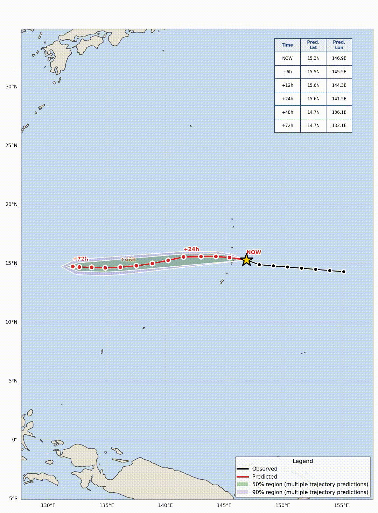

# TC-XFlow

**Physics-Guided Conditional Flow Matching for Tropical Cyclone Track Forecasting over the South China Sea**

TC-XFlow is a physics-guided generative framework for tropical cyclone track forecasting over the South China Sea. The framework combines multimodal context encoding from historical best-track observations, ERA5 environmental fields, and environmental descriptors with conditional flow matching for probabilistic trajectory generation. To improve the physical plausibility and interpretability of the generated tracks, TC-XFlow incorporates physics-guided objectives based on displacement, heading, speed calibration, and candidate trajectory quality, together with a candidate reranking mechanism. The framework further provides interpretability analyses to examine how historical track information and environmental context influence the forecasting process. Experiments are conducted on 687 tropical cyclones from 1970–2025 using a storm-wise train/validation/test split, with an input history of 48 h and a forecasting horizon of 72 h. On the test set, TC-XFlow achieves a mean DPE of 322.99 km, ATE of 268.62 km, and CTE of 172.61 km, demonstrating competitive performance against the evaluated recurrent, transformer-based, GAN-based, and diffusion-based baselines. The results also show that TC-XFlow performs particularly well at shorter and intermediate forecast horizons, while its performance degrades at the 72 h horizon, highlighting the need for future work on receding-horizon forecasting with periodic context re-encoding.

## Demo

Observed history (black), verifying track (blue), and one predicted
trajectory per seed:



## Repository Structure

```
Model/
  Encoder/                 # FNO3D / Mamba / environmental encoders
  Main_model/               # OT coupling, velocity transformer, loss.py
  Main_model.py    
Train_scripts/             # training, evaluation, visualization
assets/                      # demo gif
```

## Dataset

TC-XFlow follows the storm-collection and quality-control pipeline of
[TropiCycloneNet](https://github.com/xiaochengfuhuo/TropiCycloneNet)
(1970–2025, 687 storms, 24,885 six-hourly records), restricted to storms
relevant to the South China Sea / Northwest Pacific. Each sample combines
three aligned modalities:

- **Best-track kinematics** - latitude, longitude, minimum central
  pressure, maximum sustained wind, from the China Meteorological
  Administration Tropical Cyclone Best Track Dataset
  ([CMA-BST](https://tcdata.typhoon.org.cn/en/zjljsjj.html)) and the
  [International Best Track Archive for Climate Stewardship
  (IBTrACS)](https://www.ncei.noaa.gov/products/international-best-track-archive).
- **ERA5 reanalysis** - an 81×81 patch at 200/500/850/925 hPa plus
  sea-surface temperature, from the [ECMWF ERA5
  reanalysis](https://cds.climate.copernicus.eu/datasets/reanalysis-era5-pressure-levels).
- **Environmental descriptors** - 98-dim kinematic/temporal/categorical +
  steering-flow features, derived by the authors from the two sources
  above.

The dataset is partitioned storm-wise: 472 storms (8,470 windows) train,
203 storms (3,436 windows) validation, 12 storms (449 windows) held out as
a strict test set.

## Getting Started

### Data Preparation

First, we need to download all the data used to build TC-XFlow's inputs.

- Dataset Link: `https://huggingface.co/datasets/hananguyen18/TC-XFlow_Dataset`            
- Passwork: `tcxflow@123`

After completing the download, there are some files. The best-track
subset includes best-track kinematics (`Best_track_data`), a part of the ERA5
data (`Era5_data`, multi-level pressure fields), and environmental
descriptors (`Env-Data`). You can extract them wherever you like.

The ERA5 patches will be used as the physical context conditioning the
velocity field during training and inference.

### Training

First, download the prepared TC-XFlow dataset, which has already been
preprocessed and is ready for training:

- Link: `https://huggingface.co/hananguyen18/TC-XFlow_Checkpoints`
- Password: `tcxflow@123`

Once that's done, run the command below to start training:

```
## model training ##
cd Train_scripts
python train_fm_main.py
```

See [`RUNNING.md`](RUNNING.md) for additional setup and
visualization instructions.

## Citing